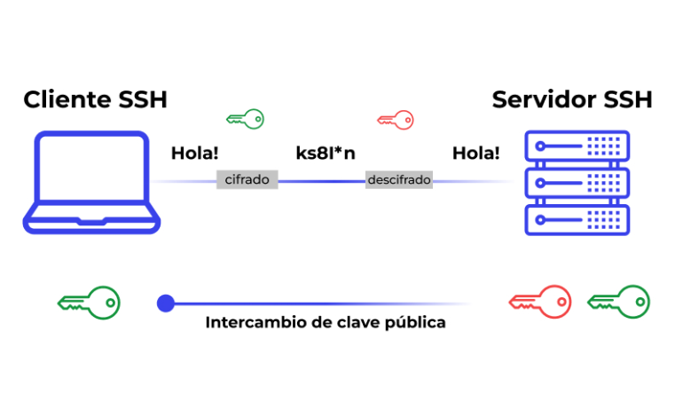

---

---
## 🔁 Las 3 Secciones de un Proyecto Git

**Git** es un sistema de control de versiones distribuido que permite a los desarrolladores gestionar los cambios en el código fuente de manera eficiente. Un proyecto en Git se divide en **tres secciones principales**:

---

### 1. 📂 Directorio de Trabajo (Working Directory)

Es la carpeta donde se encuentran los archivos del proyecto. Aquí es donde los desarrolladores crean, editan y eliminan archivos antes de confirmarlos en el repositorio. Representa una copia del estado actual del proyecto.

- Contiene los archivos visibles del proyecto.
- Los cambios realizados aún **no están guardados en Git** hasta que se añadan al área de preparación.
- Para ver los archivos modificados se puede usar:

```bash
git status
```

---

### 2. 📝 Área de Preparación (Staging Area)

También conocida como **index**, esta zona intermedia almacena los cambios que están listos para ser confirmados.

- Los cambios se añaden con:

```bash
git add nombre_del_archivo
```

o

```bash
git add .
```

- Para visualizar los archivos en esta área:

```bash
git status
git diff --staged
```

- Permite un mayor control sobre **qué se incluirá en el siguiente commit**.

---

### 3. 🗃️ Repositorio (Directorio `.git`)

Es una carpeta oculta donde Git guarda todos los cambios confirmados y metadatos del proyecto.

- Almacena el historial completo del proyecto.
- Para confirmar los cambios desde el área de preparación:

```bash
git commit -m "Mensaje del commit"
```

- Permite:
  - Restaurar versiones anteriores.
  - Gestionar colaboraciones mediante plataformas remotas como **GitHub** o **GitLab**.


# 🧠 Git: Comandos y Flujo de Trabajo Completo

## 🔧 Configuración Inicial

Configura tus datos globales:

```bash
git config --global user.name "Tu Nombre"
git config --global user.email "tu@email.com"
git config --list
```

## 📦 Crear o Clonar Repositorio

```bash
git init                  # Inicia un repositorio nuevo
git clone URL_DEL_REPO    # Clona un repositorio remoto
```

## 📁 Estructura de un Proyecto Git

- **Working Directory**: tus archivos locales.
- **Staging Area (Index)**: zona para preparar cambios.
- **Repositorio**: historial confirmado.

## 📄 Añadir Cambios

```bash
git status                # Ver estado actual
git add archivo.txt       # Añadir archivo al staging
git add .                 # Añadir todos
git reset archivo.txt     # Retirar del staging
```

## ✅ Confirmar Cambios

```bash
git commit -m "Mensaje"
git commit -a -m "Añade y comitea"
git commit --amend        # Editar último commit
```

## 🕵️ Ver Historial

```bash
git log
git log --oneline
git log --graph
```

## 📝 Ver Cambios

```bash
git diff
git diff --staged
```

## 🧹 Deshacer Cambios

```bash
git restore archivo.txt
git reset HEAD archivo.txt
git reset --hard
```

## 🌿 Trabajo con Ramas

```bash
git branch nueva-rama
git checkout nueva-rama
git checkout -b nueva-rama
git merge rama
git branch -d rama
```

## 🔄 Sincronización Remota

```bash
git remote add origin URL
git remote -v
git push origin main
git push -u origin rama
git pull origin main
```

## 🚫 Ignorar Archivos

Archivo `.gitignore` ejemplo:

```
*.log
node_modules/
.env
```

## 🏷️ Etiquetas (Tags)

```bash
git tag v1.0
git tag -a v1.0 -m "Versión 1.0"
git show v1.0
```

## 🧪 Comprobaciones

```bash
git fsck
git status
```

## 💥 Resolución de Conflictos

```bash
# Edita el archivo
git add archivo_resuelto
git commit
```

## 🧠 Buenas Prácticas

- Commits pequeños y frecuentes
- Nombres de ramas claros
- Usa `.gitignore`
- No trabajes directamente en `main`

---


## 🧪 Inicializar un Repositorio Local en Git


En esta actividad, crearemos un repositorio local en nuestro PC personal. Luego, añadiremos y modificaremos algunos archivos y registraremos los cambios, trabajando desde la terminal de texto.

---

### 🔄 Proceso a seguir

1. **Creamos una carpeta para alojar el proyecto**

```bash
mkdir mi-proyecto-git
cd mi-proyecto-git
```

2. **Comprobamos que tenemos la carpeta vacía**

```bash
ls -a
```

3. **Inicializamos el repositorio**

```bash
git init
```

4. **Comprobamos que se ha creado una carpeta `.git`**

```bash
ls -a
```

> Esta carpeta almacena todo el historial del repositorio y los cambios que realicemos.

---

### 📝 Registro de Cambios

5. **Creamos un archivo `README.md`**

```bash
touch README.md
```

6. **Añadimos una línea al archivo**

Editamos el archivo para incluir:

```
Por Manuel Martínez Montaño
```

7. **Registramos los cambios en el repositorio**

- Añadir el archivo al área de preparación:

```bash
git add README.md
```

- Confirmar los cambios en el repositorio local:

```bash
git commit -m "Añadir nombre y apellidos"
```

---

### 🔁 Repetimos el proceso dos veces más

**Primera repetición:**

- Añadimos una línea con la fecha actual al archivo `README.md`.

```markdown
Fecha: 12 de mayo de 2025
```

- Guardamos y ejecutamos:

```bash
git add README.md
git commit -m "Añadir fecha actual"
```

**Segunda repetición:**

- Añadimos una línea con el nombre del centro educativo:

```markdown
IES Inca Garcilaso
```

- Guardamos y ejecutamos:

```bash
git add README.md
git commit -m "Añadir nombre del IES"
```

---

### 🔍 Ver los cambios realizados

Podemos revisar el historial de commits con:

```bash
git log --oneline
```

---

> ✅ Este proceso permite entender el flujo básico de trabajo en Git, asegurando un control eficiente sobre las versiones del proyecto.

---

# 🔐 Uso de claves SSH en Git

El uso de claves SSH en Git permite establecer una conexión segura entre tu equipo local y servicios como GitHub, GitLab o Bitbucket sin necesidad de introducir tus credenciales cada vez que realizas una operación remota.

---

---

## 🔧 ¿Qué es SSH?

SSH (Secure Shell) es un protocolo que permite la comunicación segura entre sistemas. En Git, se utiliza para autenticarte con servidores remotos sin usar tu usuario y contraseña directamente.

---

## 🧱 ¿Cómo funciona?

SSH utiliza un **par de claves**:

- 🔑 **Clave privada**: se guarda en tu ordenador y **nunca debe compartirse**.
- 🗝️ **Clave pública**: se copia al servidor (por ejemplo, GitHub) para que se pueda reconocer tu máquina.

Cuando haces `git push` o `git pull`, Git utiliza tu clave privada para autenticarse automáticamente con el servidor remoto.

---

## 🛠️ Generar un par de claves SSH

Puedes generar tus claves con el siguiente comando:

```bash
ssh-keygen -t ed25519 -C "tu-correo@ejemplo.com"
```

> Si tu sistema no admite `ed25519`, usa: `ssh-keygen -t rsa -b 4096 -C "tu-correo@ejemplo.com"`

Esto creará dos archivos:

- `~/.ssh/id_ed25519` → tu clave **privada**
- `~/.ssh/id_ed25519.pub` → tu clave **pública**

---

## 🔗 Añadir la clave pública a GitHub

1. Copia el contenido del archivo `.pub`:

```bash
cat ~/.ssh/id_ed25519.pub
```

2. Ve a GitHub → *Settings* → *SSH and GPG keys*
3. Haz clic en **New SSH key**, pega tu clave y guarda.

---

## ✅ Verificar conexión SSH

Puedes comprobar que todo funciona con:

```bash
ssh -T git@github.com
```

Si todo está bien, verás un mensaje como:

```
Hi tu-usuario! You've successfully authenticated, but GitHub does not provide shell access.
```

---

## 📎 Configurar Git para usar SSH

Al clonar un repositorio, asegúrate de usar la URL SSH (no la HTTPS):

```bash
git clone git@github.com:usuario/repositorio.git
```

Si ya clonaste usando HTTPS y quieres cambiar a SSH:

```bash
git remote set-url origin git@github.com:usuario/repositorio.git
```

---

## 🧠 Recomendaciones

- No compartas tu clave privada.
- Usa `ssh-agent` para no tener que escribir tu contraseña cada vez.
- Puedes generar múltiples claves si usas varios servicios o cuentas.

---

Con las claves SSH configuradas, puedes trabajar de forma más segura y cómoda con tus repositorios remotos.
